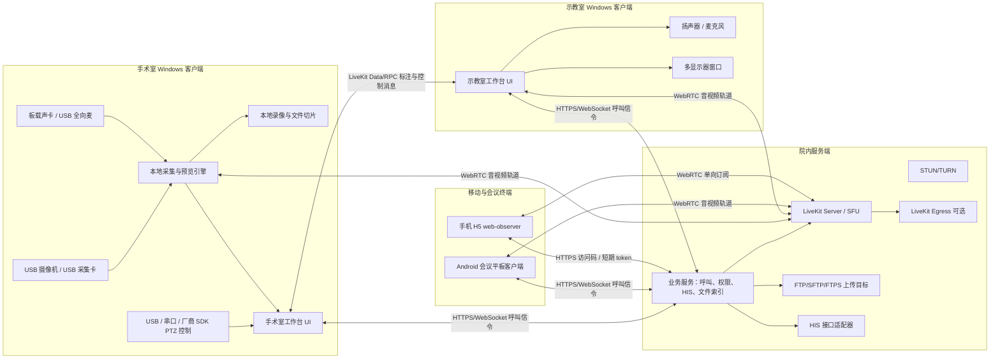
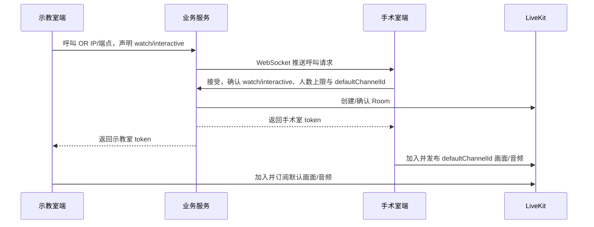

# 桌面版手术示教软件功能架构

> 适用范围：Windows 桌面 CS 架构，手术室端与示教室端双向互动，媒体中继优先采用 LiveKit。  
> 编写日期：2026-06-05。  
> 结论先行：LiveKit 适合做实时互动、房间、权限、弱网传输和远端订阅；本地多路采集、PTZ 控制、长时间录像、文件管理、HIS 对接必须由桌面客户端和业务服务端承担，不能全部塞进 LiveKit 或前端 WebView。

## 1. 产品边界

本系统是手术示教、观摩、会诊互动和录像管理软件，不是诊断、治疗决策、生命支持、麻醉监护或医疗器械控制系统。视频画面和患者资料属于敏感数据，默认按院内系统处理。

必须明确三条边界：

- LiveKit 只负责实时房间里的音视频和数据通信，不负责采集卡驱动、摄像机云台协议、录像资产管理或 HIS 业务规则。
- 手术室端必须即使离线也能完成本地预览和本地录像；远程互动失败不能影响本地采集和录像。
- 患者信息只用于录像绑定和检索，默认不向远端示教室展示完整身份信息；需要展示时必须有配置开关和审计记录。

## 2. 总体架构



推荐部署形态：

- 院内局域网优先：LiveKit 与业务服务部署在院内服务器或手术示教专用主机。
- 跨院区或公网：必须使用 TLS、TURN、中继带宽评估和访问审计。
- 单机演示：可以本机运行 LiveKit dev/self-host，但只能作为演示，不代表院内部署能力。

## 3. 客户端架构

当前仓库是 Tauri 2 + React + TypeScript + Rust。建议保留 UI 技术栈，但补一个本地媒体工作层。

### 3.0 界面视觉基线

界面配色必须参考：

- `D:\我的工作\AOV\SOP\shoushi-or-platform\doc\首视数字化手术室软件开发计划.md`
- `D:\我的工作\AOV\SOP\shoushi-or-platform\doc\视频预览页面业务逻辑开发文档.md`

当前产品统一采用 `or-preview HMI palette v0.3`：冷灰蓝医疗设备控制屏风格，以 1920x1080 全屏触控终端为基准。

强制约束：

- 主背景、面板和控件以冷灰、深灰为主。
- 医疗蓝只用于当前选中、激活、焦点和少量图标强调。
- 不使用大面积蓝色背景、蓝色导航栏、紫蓝渐变、霓虹发光、玻璃拟态和 BI 驾驶舱式视觉。
- 按钮按医疗设备实体按键处理，保证戴手套触控时的识别和命中面积。
- 第三方医疗设备截图只可作为色系和控制终端气质参考，不复制界面结构、图标、文案和素材。

详细 token 见 `docs/ui-visual-style.md`。

### 3.1 推荐分层

```text
Windows Client
  UI Layer
    React / TypeScript
    画面布局、呼叫状态、录像管理、患者绑定、标注 UI

  Realtime Layer
    livekit-client
    房间连接、发布/订阅轨道、Data/RPC、网络质量状态

  Native Bridge
    Tauri commands / events
    文件系统、设备诊断、录像目录、FTP 上传、HIS 适配调用

  Media Worker
    MVP 可先用 WebView2 MediaDevices
    正式版建议引入 FFmpeg/GStreamer/Media Foundation/DirectShow
    多路采集、稳定预览、长时间录像、音画同步、MP4 封装

  Device Control
    UVC 控制、VISCA over USB/Serial、厂商 SDK
    云台、变焦、聚焦、光圈、预置位
```

### 3.2 为什么不能只用 WebView2

WebView2 的 `getUserMedia` 可以快速验证 USB UVC 摄像机和麦克风，但有明显风险：

- 多路 1080p/4K 采集稳定性不确定。
- 长时间多通道录像依赖 `MediaRecorder` 风险高，输出格式也未必是 MP4。
- PTZ、镜头、采集卡音频映射、设备占用诊断需要 Windows 原生能力。
- 医疗场景需要断电、磁盘满、热插拔、录制恢复等更强控制。

工程建议：

- PoC/MVP：用 WebView2 `MediaDevices` 快速接 LiveKit，验证交互闭环。
- 可交付版本：本地采集和录像下沉到 Native Media Worker，UI 只做控制和渲染。

## 4. 视频源模型

### 4.1 视频源类型

| 类型 | 主路径 | 用途 | 风险 |
| --- | --- | --- | --- |
| USB UVC 摄像机 | `getUserMedia` 或 Media Foundation | 全景、术野摄像机 | 多摄同型号识别困难 |
| HDMI/SDI USB 采集卡 | UVC 或 DirectShow | 腹腔镜、内镜、超声、监护仪 | 音画同步、分辨率协商 |
| RTSP | FFmpeg/GStreamer 拉流后转本地轨道 | 网络摄像机备选 | 浏览器/WebView 不原生支持 RTSP |
| SRT | LiveKit Ingress 或本地 FFmpeg/GStreamer | 远距离低延迟流备选 | 需要源端推/拉配置 |
| 屏幕采集 | WebRTC ScreenShare 或系统捕获 | PACS/HIS 工作站画面 | 涉及患者隐私 |

LiveKit Ingress 官方支持 RTMP/RTMPS、WHIP、HTTP 媒体文件/HLS、SRT 等输入；RTSP 不应假设为 LiveKit 原生 Ingress 输入。RTSP 要进入 LiveKit，建议通过本地 FFmpeg/GStreamer 转 WebRTC/WHIP/RTMP/SRT。

### 4.2 默认通道

手术室端默认 4 个本地视频画面：

1. 全景摄像机。
2. 术野摄像机。
3. 医疗设备一路，例如腹腔镜/内镜。
4. 备用医疗设备一路，例如超声/监护/PACS。

默认策略：

- 本地始终预览 4 路。
- 远端连接建立后默认只发布或订阅一路默认画面。
- 示教室需要其他通道时，通过 RPC 请求，手术室端授权后发布或允许订阅对应轨道。
- 手机端只作为单向收看端，默认只能订阅默认画面，不允许发布音频、视频或请求交互升级。
- Android 会议平板是可安装正式客户端，可以作为示教室端或移动会诊端参与仅收看/交互/会议模式。
- 对外传输优先 1080p30；4K 本地预览可支持，但不作为默认远程分发质量。

### 4.3 连接后默认画面决策

默认画面必须由手术室端业务规则确定，不能依赖“第一路设备”“第一个 track”或 LiveKit 自动排序。LiveKit 只负责发布和订阅轨道，不负责判断哪一路是远程默认画面。

手术室端每个视频源必须保存角色和优先级：

```ts
export interface VideoChannel {
  id: string;
  displayName: string;
  role: "field" | "panorama" | "endoscope" | "device" | "auxiliary";
  enabled: boolean;
  healthy: boolean;
  localPrimary: boolean;
  remoteDefault: boolean;
  priority: number;
}
```

呼叫接通时按以下顺序确定 `defaultChannelId`：

1. 手术室端在接听界面临时指定的画面。
2. 当前本地工作台设为“主画面”的通道。
3. 配置中标记为 `remoteDefault=true` 的通道。
4. 当前可用且健康的视频源中优先级最高的一路。
5. 如果没有可用视频，只建立音频通话，并提示“未检测到可共享画面”。

业务服务在 `accept call` 响应中写入默认画面：

```ts
export interface AcceptedCallMediaPolicy {
  defaultChannelId?: string;
  defaultTrackName?: string;
  mode: "watch" | "interactive" | "conference";
  allowedChannelIds: string[];
  publishOtherChannelsOnDemand: boolean;
}
```

执行规则：

- 手术室端收到 token 后，只发布 `defaultChannelId` 对应视频轨道和手术室音频。
- 示教室端加入房间后，只订阅默认视频轨道和手术室音频。
- 其他通道必须通过 `requestTrack` 请求，手术室端确认后再发布或授权。
- 如果默认通道在呼叫建立后掉线，手术室端按同一规则重新选择可用通道，并通过 Data/RPC 通知示教室端切换。

## 5. 摄像机云台与镜头控制

摄像机如果通过 USB 接入，不等于一定可控。必须按设备协议分级：

| 控制方式 | 适用设备 | 实现方式 |
| --- | --- | --- |
| UVC 标准控制 | 普通 USB 摄像机 | Windows UVC 属性：变焦、曝光、聚焦，能力有限 |
| VISCA over USB/Serial | PTZ 摄像机 | 串口/HID/USB 转串口发送 VISCA 命令 |
| 厂商 SDK | 医疗或会议摄像机 | 独立动态库/SDK，需授权和兼容测试 |
| ONVIF PTZ | 网络摄像机备选 | 后续高级兼容，不作为主流程 |

必须抽象为统一接口：

```ts
export interface PtzController {
  getCapabilities(sourceId: string): Promise<PtzCapabilities>;
  move(sourceId: string, command: PtzMoveCommand): Promise<void>;
  zoom(sourceId: string, delta: number): Promise<void>;
  focus(sourceId: string, delta: number): Promise<void>;
  stop(sourceId: string): Promise<void>;
  recallPreset(sourceId: string, presetId: string): Promise<void>;
  savePreset(sourceId: string, presetId: string): Promise<void>;
}
```

UI 上不能显示设备不支持的按钮。每个 PTZ 命令必须有超时、停止命令和错误回显，避免云台持续运动。

## 6. 音频架构

音频输入：

- 板载声卡麦克风。
- USB 全向麦克风。
- 采集卡自带音频。

音频输出：

- Windows 默认扬声器。
- 指定 USB 声卡/会议音箱。

回音消除策略：

- LiveKit/WebRTC 默认可使用 `echoCancellation`、`noiseSuppression`、`autoGainControl` 等前端采集选项。
- 手术室全向麦 + 外放扬声器是最容易产生回声的组合，必须现场调试。
- 交互模式建议默认打开 AEC/NS/AGC，并提供“会议麦克风/耳机/外放”预设。
- 如果要高可靠语音，优先采购带硬件 AEC 的 USB 会议麦克风。

## 7. LiveKit 房间与权限模型

### 7.1 房间模型

每次手术互动创建一个 LiveKit room：

```ts
export interface TeachingRoom {
  roomId: string;
  surgeryRoomEndpointId: string;
  maxParticipants: number;
  mode: "watch" | "interactive" | "conference";
  defaultTrackIds: string[];
  patientBindingId?: string;
  createdAt: string;
}
```

参与者身份建议：

```text
or-{roomNo}-{deviceId}
teach-{department}-{deviceId}
observer-{userId}
recorder-{roomId}
```

### 7.2 仅收看与交互模式

权限必须由服务端签发 token 控制，不能由客户端自说自话。

| 模式 | canSubscribe | canPublish | canPublishData | 说明 |
| --- | --- | --- | --- | --- |
| 手术室主持端 | true | true | true | 发布手术视频、音频、标注 |
| 示教室仅收看 | true | false | true | 可看、可发低风险控制消息，不发音视频 |
| 示教室交互 | true | true | true | 可发布麦克风，必要时可发布摄像头 |
| Android 会议平板 | true | true/false | true | 正式客户端，权限由手术室端接受呼叫时确认 |
| 手机 H5 观察者 | true | false | false | 只允许单向收看，不允许发音视频或控制消息 |
| 会议观察者 | true | false | false/true | 由手术室端策略决定 |

权限变更使用服务端 Participant Update。示教室从仅收看升级为交互时，应由手术室端确认，服务端再更新权限。

### 7.3 手机端单向收看与媒体转发

手机端不安装客户端时，只作为 `web-observer` 进入系统。它不是正式示教室端，不参与双向互动，也不直接连接手术室端或 Native Media Worker。

连接路径固定为：

```text
手机浏览器
  -> 业务服务：访问码/登录、人数检查、短期 token
  -> LiveKit/SFU：订阅默认画面和手术室音频
  -> 手术室端：只发布一次默认画面
```

强制规则：

- 手机端 token 必须是 `canSubscribe=true`、`canPublish=false`、`canPublishData=false`。
- 手机端默认只能订阅 `defaultChannelId` 对应轨道和手术室音频。
- 手机端不允许申请语音交互、摄像头发布、PTZ 控制或标注。
- 手机端观看并发必须由 LiveKit/SFU 承担媒体转发，手术室端不得为每台手机建立独立推流或转码进程。
- 手术室端对同一默认画面只发布一次；10 个手机观看时，手术室上行仍应接近 1 路默认画面的码率，而不是 10 路。
- 手机端人数上限由业务服务控制，并结合 LiveKit room participant limit 或服务端入房前检查。

手机端能力边界：

- 适合临时观摩、领导巡查、家属沟通等单向观看场景。
- 不适合作为正式示教室交互终端。
- 必须使用 HTTPS 页面，否则移动浏览器音视频权限不可控。
- 不保证锁屏、后台、来电、微信内置浏览器等场景下持续播放。

### 7.4 Android 会议平板客户端

Android 会议平板可以安装客户端，应作为正式终端，而不是手机 H5 观察者。推荐使用 LiveKit Android SDK 开发横屏大屏客户端。

会议平板能力：

- 可作为示教室端、移动会诊端、主任办公室端。
- 可发起呼叫，也可接受手术室呼叫。
- 可选择仅收看或交互模式；最终权限由手术室端确认。
- 交互模式可发布麦克风，是否发布摄像头由现场策略决定。
- 可请求其他视频通道，仍需手术室端确认。
- 支持横屏布局、全屏、常亮、自动重连、日志上报。
- 支持多画面布局和单画面放大，但默认仍只订阅 `defaultChannelId`。

会议平板限制：

- 不承担手术室本地采集、录像或 PTZ 主控职责。
- 不保存 LiveKit secret。
- 不直接连接 Native Media Worker。
- 不绕过业务服务加入房间。

### 7.5 人数限制

人数限制不要只靠 UI：

- 业务服务创建房间时记录 `maxParticipants`。
- 呼叫/加入前由业务服务检查当前人数。
- 可结合 LiveKit room 的 `maxParticipants` 做第二层限制。
- 超过人数时，新用户收到明确提示：房间已满、当前限制、联系手术室端调整。
- Android 会议平板应有独立上限，例如 `maxTabletClients`。
- 手机 H5 观察者应有独立并发上限，例如 `maxWebObservers`，不能与正式交互端混用同一额度。

## 8. 呼叫流程

“通过 IP 地址呼叫手术室”建议解释为业务层的端点寻址，而不是让两个客户端直接裸连音视频。

### 8.1 示教室呼叫手术室



如果手术室端未登录业务服务，可退化为 LAN 直连控制端口，但仍建议媒体走 LiveKit，避免后续权限、录制、多人会议失控。

### 8.2 手术室呼叫示教室

流程相同，发起方变为手术室端。业务服务负责找到在线示教室端并发出邀请。

## 9. 远端按需拉取其他画面

推荐协议：

- `requestTrack`: 示教室请求某一路源。
- `approveTrack`: 手术室端同意。
- `publishTrack`: 手术室端发布或解除该轨道订阅权限。
- `releaseTrack`: 示教室不再观看，手术室可停止发布以节省带宽。

消息可用 LiveKit RPC；连续状态如标注坐标用 data packets/data track。

```json
{
  "type": "requestTrack",
  "requestId": "req-20260605-001",
  "sourceId": "scope-camera",
  "quality": "1080p30",
  "reason": "teaching-room-layout"
}
```

## 10. 标注

手术室端支持画面标注，远端可见。不要把标注直接画死进视频流作为唯一方案。

推荐实现：

- 手术室 UI 在视频层上方渲染 Canvas/SVG 标注层。
- 标注事件使用归一化坐标 `[0,1]`，绑定 `sourceId`、视频宽高、时间戳。
- 远端通过 LiveKit reliable data packet 接收并渲染同样标注层。
- 如果录像需要保留标注，录像合成器必须把标注层合进 MP4，或者把标注 JSON 作为 sidecar 元数据保存。

事件格式：

```ts
export interface AnnotationEvent {
  type: "stroke" | "clear" | "pointer" | "text";
  sourceId: string;
  annotationId: string;
  points?: Array<{ x: number; y: number; t: number }>;
  color?: string;
  width?: number;
  text?: string;
  createdAt: string;
}
```

## 11. 录像、回放与文件管理

### 11.1 录像策略

用户可以选择部分通道或全部通道录像。这里不能只做一个合成画面，否则后期检索和 AI 处理会受限。

建议同时支持两种产物：

- 单通道原始录像：每个选中视频源独立 MP4 文件，便于后续 AI 和追溯。
- 合成录像：按当前布局输出一路 MP4，便于普通回放和教学归档。

目录结构：

```text
Recordings/
  2026/
    2026-06-05/
      ST-20260605-001/
        manifest.json
        channel-01-panorama.mp4
        channel-02-field.mp4
        channel-03-laparoscope.mp4
        composite-main.mp4
        annotation.json
        logs.txt
```

### 11.2 元数据

```ts
export interface RecordingManifest {
  recordingId: string;
  roomId?: string;
  patientBindingId?: string;
  patientDisplayName?: string;
  patientNo?: string;
  surgeryName?: string;
  surgeon?: string;
  startedAt: string;
  endedAt?: string;
  channels: RecordingChannel[];
  annotations?: string;
  aiJobs?: AiJobRef[];
}
```

患者敏感字段不要写进文件名。文件名应使用手术号、日期、匿名编号或院内流水号。

### 11.3 导出与上传

- 本地存储：SQLite 索引 + 文件系统实体。
- 回放：本机播放器页面，支持按通道、按时间轴、按患者绑定查询。
- 移动存储导出：校验空间、写入 manifest、导出完成后做文件大小校验。
- FTP 上传：普通 FTP 明文传输风险高，只能作为兼容选项；优先 SFTP 或 FTPS。
- 上传断点续传和失败重试必须进入计划，否则现场网络波动会导致大量人工补传。

## 12. HIS 对接

HIS 对接要做成适配器，不要写死某一家医院数据库。

支持路径：

- HL7 v2 消息。
- FHIR REST API。
- 医院提供的 HTTP/WebService。
- 只读数据库视图，需院方授权。
- 手工录入作为兜底。

同步策略：


隐私要求：

- HIS 凭据只保存在服务端或 Windows 安全存储中。
- 客户端日志不得记录身份证号、完整手机号、完整住址。
- 远端示教室默认只显示手术名称、科室、匿名编号或脱敏患者标签。

## 13. AI 识别预留接口

AI 不进入第一版实时链路。推荐异步作业接口：

```ts
export interface AiJob {
  jobId: string;
  recordingId: string;
  inputChannels: string[];
  taskType: "scene-detection" | "instrument-detection" | "speech-transcription" | "summary";
  status: "queued" | "running" | "done" | "failed";
  resultPath?: string;
  createdAt: string;
  updatedAt: string;
}
```

第一版只需要：

- manifest 里保留 AI job 引用。
- 文件管理页预留“发送 AI 处理”按钮的 disabled 状态。
- 后台 API 设计好，不实现模型推理。

## 14. 服务端模块

```text
server/
  auth/
    LiveKit token 签发
    角色权限策略
  signaling/
    呼叫、应答、拒绝、超时、在线状态
  rooms/
    房间创建、人数限制、模式切换
  his/
    HIS 适配器与患者绑定
  recordings/
    录像索引、上传任务、导出记录
  audit/
    登录、呼叫、录像、导出、上传审计
```

最小服务端 API：

```http
POST /api/endpoints/register
POST /api/calls
POST /api/calls/{callId}/accept
POST /api/calls/{callId}/reject
POST /api/livekit/token
POST /api/rooms/{roomId}/permissions
GET  /api/patients/search
POST /api/recordings
POST /api/uploads/ftp
GET  /api/audit
```

## 15. 推荐技术选型

### 15.1 保守 MVP

- 客户端：当前 Tauri 2 + React + TypeScript。
- 实时互动：`livekit-client`。
- 采集：WebView2 `MediaDevices`，只验证 USB 摄像机/采集卡。
- 录像：单路 WebM 或简单 MP4 转码，仅用于验证。
- 服务端：Node.js/NestJS 或 Rust Axum，提供 token、呼叫、HIS mock。

适合快速出可演示版本，不适合承诺院内长期录像稳定性。

### 15.2 可交付版本

- 客户端：Tauri UI + Rust/C++ Media Worker。
- 采集：Media Foundation/DirectShow 或 GStreamer。
- 录制：FFmpeg/GStreamer 输出 MP4，支持分段和恢复。
- 实时互动：LiveKit JS 或 Native SDK 发布编码后的轨道。
- 服务端：业务服务 + LiveKit + TURN + 可选 Egress。

这是更合理的工程路线。

### 15.3 替代架构

| 方案 | 优点 | 缺点 | 建议 |
| --- | --- | --- | --- |
| LiveKit | 房间、权限、SFU、数据通道、Egress/Ingress 完整 | 本地采集和录像不是它的职责 | 推荐作为互动核心 |
| mediasoup | 可高度定制 SFU | 服务端开发成本高，工具链更重 | 团队有 WebRTC 专家才选 |
| Janus | 网关能力成熟，协议插件多 | 应用层体验和 SDK 需自建较多 | RTSP/传统协议多时可评估 |
| GStreamer/FFmpeg + SRT | 单向传输稳定、可控 | 双向互动、权限、多人会议弱 | 只做直播观摩可选 |
| OBS/NDI 工作流 | 快速搭建、生态成熟 | 不像一体化医疗软件，患者绑定和权限弱 | 演示或临时项目可用 |

结论：不要用 LiveKit 替代本地媒体引擎；也不要用 FFmpeg/SRT 替代互动会议系统。合理组合是 LiveKit + Native Media Worker + 业务服务。

## 16. 关键风险

1. 多路 USB 带宽和供电：4 路采集需要硬件白名单和降级策略。
2. 录制可靠性：医疗录像不能只依赖浏览器 `MediaRecorder`。
3. 回声消除：全向麦 + 外放环境必须现场调试，软件不能保证所有硬件组合都稳定。
4. RTSP 输入：LiveKit Ingress 不应被当成 RTSP 拉流器。
5. 患者隐私：HIS 绑定、录像导出、FTP 上传都需要审计和脱敏。
6. 远端按需拉流：如果所有通道一直发布，手术室上行带宽会被打满；如果按需发布，状态机要做复杂一些。
7. PTZ 控制：USB 摄像机控制协议差异大，必须先锁定硬件型号。

## 17. 官方资料依据

- LiveKit media tracks: https://docs.livekit.io/home/client/tracks/
- LiveKit camera and microphone publishing: https://docs.livekit.io/home/client/tracks/publish/
- LiveKit noise and echo cancellation: https://docs.livekit.io/home/client/tracks/noise-cancellation/
- LiveKit tokens and grants: https://docs.livekit.io/home/server/generating-tokens
- LiveKit participant management: https://docs.livekit.io/home/server/managing-participants/
- LiveKit Ingress overview: https://docs.livekit.io/realtime/ingress/overview/
- LiveKit Egress overview: https://docs.livekit.io/home/egress/overview
- LiveKit data/RPC: https://docs.livekit.io/home/client/data
- LiveKit C++ SDK reference: https://docs.livekit.io/reference/client-sdk-cpp/
