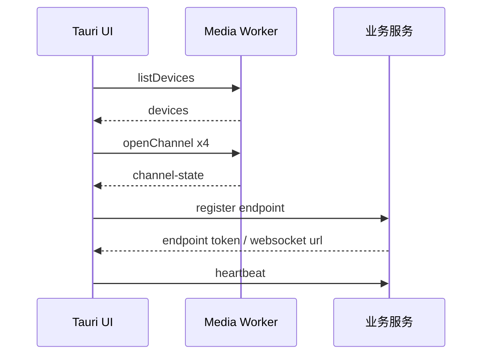
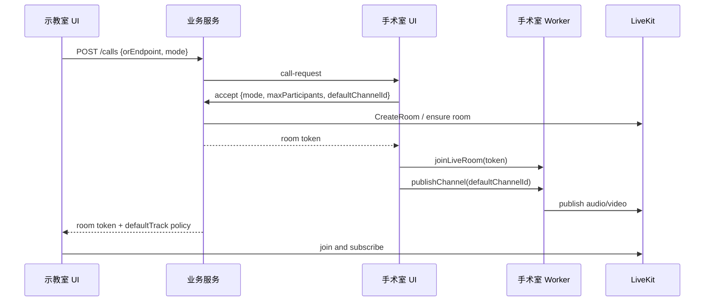
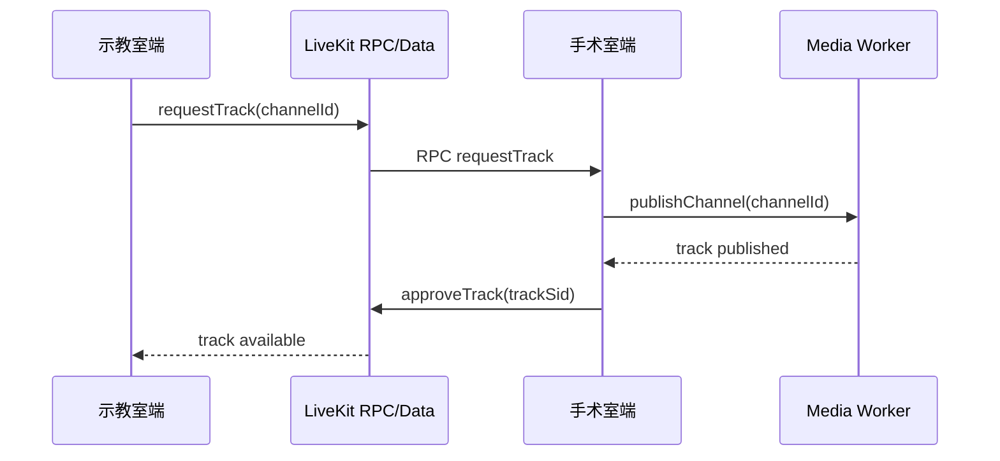

# LiveKit + Native Media Worker + 业务服务设计描述与可行性验证

> 适用仓库：`D:\我的工作\AOV\SmartST Lite`  
> 编写日期：2026-06-05  
> 结论：该组合可行，但必须按三包职责拆开实现。SmartST Server 负责 LiveKit、业务服务、JWT、呼叫、权限、审计和可选 HIS/上传；SmartST OR Agent 负责 Windows 本地采集、Native Media Worker、PTZ、预览、录像和设备恢复；Desktop Client 只做 UI 和人工操作入口。不能把本地采集录像交给 LiveKit，也不能把业务权限交给客户端 UI。

## 1. 总体判断

推荐采用三包结构：

```text
SmartST Server
  -> LiveKit Server / TURN
  -> LiveKit Server API / Token
  -> HIS Adapter
  -> Recording Index / Upload / Audit

SmartST OR Agent
  -> Native Media Worker
  -> Windows Media Foundation / WASAPI / PTZ SDK
  -> 本地预览 / 本地 MP4 分段录像
  -> LiveKit C++ SDK、WebRTC 发布层或后续发布组件

SmartST Desktop Client
  -> SmartST Server API / WebSocket
  -> SmartST OR Agent API / 本机控制面
  -> LiveKit Client 订阅/交互 UI
```

物理部署不强制独立服务器。默认现场可以把三包同装在手术室电脑上；工程上仍必须保持进程、权限、配置和升级边界分离。详细标准见 `docs/deployment-package-split.md`。

可行性分级：

| 能力 | 可行性 | 结论 |
| --- | --- | --- |
| 手术室 4 路本地预览 | 可行，但依赖硬件和媒体栈验证 | Native Worker 必须优先验证 |
| 主画面 LiveKit 远程互动 | 可行 | LiveKit 标准能力覆盖 |
| 双向语音与回音消除 | 可行，但现场效果依赖硬件 | 软件 AEC 不能替代硬件 AEC 麦克风 |
| 仅收看/交互权限 | 可行 | 服务端 token 和 participant permission 实现 |
| 手机 H5 单向收看 | 可行 | 只能订阅，媒体转发由 LiveKit/SFU 承担 |
| Android 会议平板客户端 | 可行 | 使用 LiveKit Android SDK，经业务服务入房 |
| 多通道本地录像 | 可行，但不应依赖 WebView `MediaRecorder` | Native Worker 负责 |
| RTSP/SRT 备选输入 | 可行，但不是同一路径 | RTSP 需本地转接；SRT 可走 Ingress 或本地转接 |
| HIS 绑定与文件管理 | 可行 | 业务服务和本地索引负责 |
| 多显示器扩展 | 可行 | UI/Tauri 多窗口 + 远端 track 渲染 |
| PTZ/镜头控制 | 条件可行 | 必须锁定设备协议和 SDK |

## 2. 三包职责

### 2.1 SmartST Server

SmartST Server 是控制面和实时服务节点。它可以安装在手术室电脑，也可以安装在独立院内主机。它包含 LiveKit Server 和业务服务，但二者仍是独立进程。

职责：

- 启动和管理 LiveKit Server 配置。
- 房间：每台手术或每次示教创建一个 room。
- 参与者：手术室端、示教室端、观察者、可选录制参与者。
- 轨道：主画面、辅助画面、麦克风、可选屏幕共享。
- 权限：`canPublish`、`canSubscribe`、`canPublishData`、`roomAdmin`、`roomRecord`。
- 数据通道/RPC：标注、按需拉流、模式切换、主持控制。
- 弱网和订阅：远端按需订阅轨道，避免手术室上行带宽浪费。
- 手机 H5 观察者：只订阅默认画面，由 LiveKit/SFU 负责一对多转发。
- Android 会议平板：作为正式客户端参与房间，权限由业务服务 token 控制。
- 可选 Egress：用于远端房间合成录制或云端备份，不替代手术室本地录像。
- 客户端注册、呼叫、接受、拒绝、挂断。
- HIS 查询、患者绑定、录像索引、上传和审计。
- 保存 `LIVEKIT_API_SECRET`、HIS 凭据和服务侧配置。

不负责：

- USB 采集卡枚举和稳定打开。
- PTZ/镜头控制。
- 长时间本地录像和断电恢复。
- USB 设备驱动级恢复。
- 本地长时间录像写入。

### 2.2 SmartST OR Agent

SmartST OR Agent 是手术室电脑上的本地后端。Native Media Worker 是 OR Agent 管理的媒体执行进程，不建议长期由 Tauri UI 直接托管。媒体采集和编码可能崩溃、卡死或泄漏资源，独立后台服务更容易重启和隔离。

职责：

- 枚举视频/音频设备。
- 打开 USB UVC 摄像机和 HDMI/SDI USB 采集卡。
- RTSP/SRT 输入的本地转接。
- 采集参数协商：分辨率、帧率、像素格式、音频采样率。
- 本地低延迟预览输出。
- 编码和分段录像。
- 音画同步。
- 设备热插拔、占用、断流恢复。
- PTZ/镜头控制适配。
- 向 LiveKit 发布媒体帧，或向 UI 提供可发布的本地轨道。
- 向 Desktop Client 提供设备状态、本地预览状态、录像状态和可读错误。

推荐优先级：

1. Windows Media Foundation + WASAPI：Windows 10/11 新代码优先方向，适合 UVC 和声卡。
2. GStreamer：跨协议和管线能力强，适合 RTSP/SRT/复杂编码，但部署体积和插件管理更重。
3. FFmpeg CLI/libav：录制、转码和协议支持强，做长期服务需处理进程和错误恢复。
4. DirectShow：仅作为兼容旧采集卡的 fallback；Microsoft 已将 DirectShow 标为 legacy。

### 2.3 Desktop Client

Desktop Client 是手术室和示教室的操作入口，不是服务端，不是媒体守护进程。

职责：

- 手术室工作台 UI、示教室工作台 UI。
- 调用 SmartST Server 发起/接受呼叫、获取短期 token、显示房间状态。
- 调用 SmartST OR Agent 做设备选择、预览、录像、PTZ 操作。
- 订阅 LiveKit 远端 track，渲染默认画面和按需画面。
- 显示服务状态、端口、日志入口和 preflight 结果。

不应放在客户端：

- LiveKit API secret。
- HIS 凭据。
- 全局权限判断。
- 录像删除/上传审计策略。
- LiveKit Server 或业务服务生命周期。
- Native Worker 独占采集和长时间录像责任。

## 3. 进程与通信设计

### 3.1 Windows 进程

```text
SmartST Server
  livekit-server.exe
  smartst-business-service.exe

SmartST OR Agent
  smartst-or-agent.exe
  smartst-native-worker.exe

SmartST Desktop Client
  smartst-lite.exe
  React/Tauri UI
```

### 3.2 IPC 选择

优先建议：

- 控制面：Windows Named Pipe 或 localhost HTTP/gRPC，JSON/Protobuf 消息。
- 事件面：worker -> UI 事件流，包含设备状态、录像状态、媒体统计、错误。
- 媒体面：不要把全帧视频通过 Tauri IPC 传输。

媒体预览有三种方案：

| 方案 | 优点 | 缺点 | 建议 |
| --- | --- | --- | --- |
| WebView2 `getUserMedia` 直接预览 | 实现最快 | 和 Worker 抢设备，长期不可靠 | 只用于 PoC |
| Worker 输出本地 WebRTC/LiveKit loopback track | UI 渲染容易，链路接近远端 | 本地也走编码传输，有延迟 | MVP 可用 |
| Worker 原生 Direct3D 渲染子窗口 | 性能最好 | Tauri 集成复杂 | 可交付版本评估 |

第一版建议采用“两阶段”：

- PoC：UI 用 `getUserMedia` 预览，LiveKit JS 发布一路主画面。
- 正式媒体链路：Worker 独占设备，UI 通过 Worker 提供的预览流或原生窗口显示。

## 4. Native Media Worker 模块

```text
media-worker/
  device/
    video_enumerator
    audio_enumerator
    stable_device_id_mapper
  capture/
    media_foundation_video_capture
    wasapi_audio_capture
    rtsp_srt_input_adapter
  pipeline/
    frame_clock
    av_sync
    scaler
    encoder
    preview_output
  recording/
    mp4_segment_writer
    manifest_writer
    recovery_index
  livekit/
    room_client
    track_publisher
    network_stats
  ptz/
    uvc_control
    visca_serial
    vendor_sdk_adapter
  ipc/
    command_server
    event_stream
```

### 4.1 Worker 控制 API

```ts
export interface MediaWorkerApi {
  listDevices(): Promise<DeviceSnapshot>;
  openChannel(request: OpenChannelRequest): Promise<ChannelState>;
  closeChannel(channelId: string): Promise<void>;
  setChannelProfile(channelId: string, profile: MediaProfile): Promise<void>;
  startPreview(channelId: string, target: PreviewTarget): Promise<void>;
  stopPreview(channelId: string): Promise<void>;
  startRecording(request: StartRecordingRequest): Promise<RecordingState>;
  stopRecording(recordingId: string): Promise<RecordingManifest>;
  joinLiveRoom(request: JoinLiveRoomRequest): Promise<LiveRoomState>;
  publishChannel(channelId: string, options: PublishOptions): Promise<PublishedTrackInfo>;
  unpublishChannel(channelId: string): Promise<void>;
  leaveLiveRoom(roomId: string): Promise<void>;
  ptz(command: PtzCommand): Promise<PtzResult>;
}
```

### 4.2 Worker 事件

```ts
export type MediaWorkerEvent =
  | { type: "device-added"; device: MediaDeviceInfoLite }
  | { type: "device-removed"; deviceId: string }
  | { type: "channel-state"; channelId: string; state: ChannelState }
  | { type: "recording-state"; recordingId: string; state: RecordingState }
  | { type: "livekit-state"; roomId: string; state: LiveRoomState }
  | { type: "stats"; payload: MediaStats }
  | { type: "error"; severity: "warn" | "error"; code: string; message: string };
```

### 4.3 录像策略

正式版本应由 Worker 写 MP4，不建议依赖 WebView `MediaRecorder`。

录像模式：

- 原始通道录像：每个通道独立 MP4。
- 合成录像：按布局输出一路 MP4。
- 分段写入：例如每 5 分钟一个 segment，manifest 记录连续性。
- 崩溃恢复：启动时扫描未关闭 manifest，标记异常结束并尝试修复索引。

## 5. LiveKit 集成方式

有两条可选路径。

### 5.1 路径 A：UI 使用 `livekit-client`

流程：

- UI 通过浏览器 WebRTC 打开摄像头/麦克风。
- UI 获取业务服务签发的 token。
- UI 直接加入 LiveKit room 并发布轨道。

优点：

- 现有 Tauri/React 仓库改动较小。
- 官方 JS SDK 成熟，适合快速 PoC。
- UI 渲染远端画面简单。

缺点：

- 多路采集和录像稳定性弱。
- Worker 与 UI 可能抢设备。
- PTZ、录制、设备诊断被割裂。

结论：只适合 PoC 和演示版，不适合最终可交付架构。

### 5.2 路径 B：Worker 使用 LiveKit C++ SDK

流程：

- Worker 使用 Windows 媒体栈采集真实设备。
- Worker 将音频帧、视频帧送入 LiveKit C++ SDK 的 source/track。
- UI 只负责控制 Worker、显示状态和渲染远端/本地预览。

优点：

- 设备独占权清晰。
- 采集、编码、录像、发布可统一管理。
- 更适合多路、长时间、现场恢复。

缺点：

- C++/Rust/CMake/打包复杂度更高。
- LiveKit C++ SDK 接受应用提供的原始帧，但不替你打开摄像机；采集链路要自建。
- UI 本地预览要额外设计。

结论：这是可交付版本推荐路径。

### 5.3 推荐落地策略

不要一开始就做完整路径 B。建议：

1. 用路径 A 在 1 到 2 周内验证 LiveKit 房间、权限、音频和基本 UI。
2. 同时做 Worker synthetic frame PoC：Worker 不采集摄像头，只生成测试音视频帧并发布到 LiveKit。
3. synthetic frame 通过后，再把 Media Foundation 采集帧接进 Worker。
4. 最后把 UI 预览从 `getUserMedia` 迁移到 Worker 输出。

## 6. 业务服务设计

### 6.1 服务模块

```text
business-service/
  endpoint-registry
  call-signaling
  room-orchestrator
  token-service
  participant-policy
  patient-adapter
  recording-catalog
  export-upload-job
  audit-log
```

### 6.2 核心 API

```http
POST /api/endpoints/register
POST /api/endpoints/heartbeat
GET  /api/endpoints?type=or

POST /api/calls
POST /api/calls/{callId}/accept
POST /api/calls/{callId}/reject
POST /api/calls/{callId}/hangup

POST /api/rooms
POST /api/rooms/{roomId}/tokens
POST /api/rooms/{roomId}/mode
POST /api/rooms/{roomId}/participants/{identity}/permissions

GET  /api/patients/search
POST /api/recordings
GET  /api/recordings
POST /api/recordings/{recordingId}/bind-patient

POST /api/uploads
GET  /api/uploads/{jobId}
GET  /api/audit
```

### 6.3 Token 策略

token 必须短期签发：

| 角色 | 权限 |
| --- | --- |
| 手术室主持端 | `roomJoin=true`、`canPublish=true`、`canSubscribe=true`、`canPublishData=true` |
| 示教室仅收看 | `roomJoin=true`、`canPublish=false`、`canSubscribe=true`、`canPublishData=true/false` |
| 示教室交互 | `roomJoin=true`、`canPublish=true`、`canSubscribe=true`、`canPublishData=true` |
| Android 会议平板 | 按 `tablet-watch` 或 `tablet-interactive` 模式签发 |
| 手机 H5 观察者 | `roomJoin=true`、`canPublish=false`、`canSubscribe=true`、`canPublishData=false` |
| 服务端录制 | `roomRecord=true`，由服务端持有，不下发给客户端 |

业务服务必须是唯一 token 签发者。客户端不能保存 API secret。

手机端 token 额外限制：

- identity 使用 `web-observer-{accessCode}-{random}`，不能复用手术室或示教室身份。
- metadata 标记 `clientType=web-observer`、`mode=watch-only`。
- 只允许订阅默认轨道；如果 SDK 层不能按 token 精确限制单轨订阅，业务服务和前端必须在入房后只展示默认轨道，并在服务端审计异常订阅行为。
- 手机端不允许发起 `requestTrack`、`requestInteraction`、`ptz`、`annotation` 等控制类 RPC。

### 6.4 手机端单向收看和 SFU 转发

手机端不安装客户端时，架构上只能作为 H5 单向观察者。手术室端不能承担手机多并发转发。

正确媒体路径：

```text
手术室 Worker
  -> 发布 1 路 defaultChannelId 到 LiveKit
  -> LiveKit/SFU 转发给 N 个手机浏览器
  -> 手机只订阅，不发布
```

错误路径：

```text
手术室 Worker
  -> 为每台手机单独推一路 HTTP/WebRTC/RTMP
```

错误路径必须禁止，原因：

- 手术室端上行带宽会随手机数量线性增长。
- Worker 需要为每个手机维护独立编码/转发状态，影响本地预览和录像可靠性。
- 权限、人数限制、审计会绕开业务服务和 LiveKit。

并发控制建议：

- `maxInteractiveParticipants`：正式交互终端数量。
- `maxTabletClients`：Android 会议平板客户端数量。
- `maxWebObservers`：手机 H5 观察者数量。
- 业务服务入房前检查上限；超过后不签发 token。
- LiveKit room participant limit 作为第二层保护。

### 6.5 Android 会议平板连接策略

Android 会议平板可以安装客户端，应按正式终端处理，而不是复用手机 H5 页面。

推荐实现：

- 使用 LiveKit Android SDK 或 React Native 客户端；院内固定平板优先 Android 原生。
- 启动后向业务服务注册 `clientType=tablet-client`。
- 发起呼叫时声明 `tablet-watch` 或 `tablet-interactive`。
- 手术室端接受后，业务服务签发相应 token。
- 默认订阅 `defaultChannelId` 和手术室音频。
- 需要其他通道时通过业务服务或 LiveKit RPC 发起 `requestTrack`。
- 交互模式允许发布麦克风；摄像头发布默认关闭，需策略允许。

平板客户端不得：

- 保存 LiveKit API secret。
- 直接连接手术室 Native Media Worker。
- 绕过业务服务加入 LiveKit room。
- 承担手机 H5 并发转发。

### 6.6 默认画面决策

连接建立后的默认显示画面不是 LiveKit 的自动行为，必须由手术室端和业务服务共同确定。业务服务只记录和下发策略，最终画面健康状态由手术室端和 Worker 判断。

默认画面选择顺序：

1. 手术室端接听呼叫时临时指定的通道。
2. 手术室端本地工作台当前 `localPrimary=true` 的通道。
3. 手术室端配置中 `remoteDefault=true` 的通道。
4. 当前可选择通道中 `priority` 最小或最高优先级的一路。可选择通道至少不能是 `enabled=false`、`health=offline` 或 `health=error`。
5. 如果没有可用视频，只建立音频，并向双方提示“未检测到可共享画面”。

业务服务在 `POST /api/calls/{callId}/accept` 中保存并返回：

```json
{
  "room": {
    "roomId": "room-...",
    "roomCode": "ST-20260605-001",
    "mode": "interactive",
    "mediaPolicy": {
      "defaultChannelId": "field-camera",
      "defaultTrackName": "video:field-camera",
      "defaultChannelDisplayName": "术野摄像机",
      "defaultSelectionReason": "manual-accept",
      "startupVideoMode": "default-video",
      "allowedChannelIds": ["field-camera", "panorama", "endoscope", "aux-device"],
      "publishOtherChannelsOnDemand": true
    }
  }
}
```

当前 `server-poc` 已把 `defaultChannelId`、`defaultTrackName` 和 `startupVideoMode` 同步写入 mock token response metadata 与真实 LiveKit JWT metadata；手机 H5 观察者也能读取这些字段，但权限仍是 subscribe-only。

Worker 执行规则：

- `defaultChannelId` 存在且健康时，优先发布该通道。
- `defaultChannelId` 不健康时，Worker 返回 `channel-unhealthy`，UI 按同一规则请求重新选择。
- 示教室端默认只订阅默认视频轨道和手术室音频。
- 手机 H5 观察者只能订阅默认视频轨道和手术室音频。
- 其他通道必须走 `requestTrack`，避免连接一建立就把 4 路视频全部推上 LiveKit。

## 7. 核心流程

### 7.1 手术室启动



### 7.2 示教室呼叫并互动



### 7.3 按需拉取第二路画面



## 8. 可行性验证计划

### 8.1 PoC A：LiveKit 基础互动

目标：验证业务服务签发 token、UI 加入房间、主画面和麦克风发布、示教端订阅。

实现方式：

- 使用当前 Tauri/React。
- 引入 `livekit-client`。
- 本机或局域网部署 LiveKit。
- 业务服务只实现 token 和 room API。

通过标准：

- 手术室端发布 720p30 或 1080p30 主画面。
- 示教室端 30 分钟观看不中断。
- 5 到 20 个手机 H5 观察者同时观看时，手术室端只发布 1 路默认画面，手术室上行码率不随手机数量线性增长。
- 双向语音 30 分钟可用。
- 仅收看 token 无法发布音频。
- 手机 H5 token 无法发布音频、视频或 Data/RPC 控制消息。
- token 不包含 LiveKit secret。

失败门槛：

- WebView2 权限或采集不稳定，不影响整体架构，但 PoC UI 直采路径不能进入正式版。

### 8.2 PoC B：Native Worker 发布合成帧

目标：验证 Worker 进程、LiveKit C++ SDK、业务 token、UI 控制 Worker 的闭环。

实现方式：

- `smartst-media-worker.exe` 生成 1280x720 RGBA 测试视频帧和 48 kHz 单声道测试音频。
- Worker 使用 LiveKit C++ SDK 加入 room 并发布 track。
- UI 通过 IPC 发起 `joinLiveRoom`、`publishSynthetic`、`leaveLiveRoom`。

通过标准：

- Worker 独立进程可启动、退出、重启。
- Worker 发布 synthetic 音视频 2 小时不崩溃。
- 示教室端可订阅 Worker 发布的 track。
- UI 崩溃重启后能重新连接 Worker 或重启 Worker。

失败门槛：

- 如果 C++ SDK 打包或依赖不可控，改用 Worker 通过 WHIP/RTMP/SRT 进入 LiveKit Ingress，但要接受额外延迟和部署复杂度。

### 8.3 PoC C：Media Foundation 采集真实 USB 视频

目标：验证真实 USB 采集设备进入 Worker。

实现方式：

- 使用 Media Foundation 枚举视频设备。
- 用 Source Reader 获取视频帧。
- 用 WASAPI 获取音频。
- 先本地预览/保存测试帧，再送入 LiveKit C++ SDK。

通过标准：

- 1 路 1080p30 采集 2 小时稳定。
- 2 路 1080p30 同时采集 1 小时稳定。
- 4 路按目标硬件矩阵至少 30 分钟稳定。
- 热插拔有明确事件和恢复策略。
- 设备被占用时能返回可读错误。

失败门槛：

- 4 路 Media Foundation 不稳定时，评估 GStreamer 或 FFmpeg DirectShow fallback。
- 同型号采集卡 ID 不稳定时，必须增加用户确认映射，不能自动猜测。

### 8.4 PoC D：Native 多通道录像

目标：验证本地录像可靠性。

实现方式：

- Worker 将 1 到 4 路输入分别写 MP4。
- 每路独立文件，manifest 记录开始/结束、编码、异常。
- 先不做合成录像。

通过标准：

- 单路 2 小时 MP4 可播放。
- 4 路 2 小时后文件完整，音画同步误差可接受。
- 磁盘空间不足前预警。
- Worker 被杀后已写文件可修复或明确标记不可恢复。

失败门槛：

- 如果 MP4 长文件尾部索引损坏风险高，必须改分段录制，不允许只写单个大文件。

### 8.5 PoC E：业务服务呼叫与权限

目标：验证业务层可独立控制模式和人数。

实现方式：

- 实现端点注册、WebSocket 呼叫、接受/拒绝。
- 创建 LiveKit room 时设置 `maxParticipants`。
- 示教端申请交互时，业务服务更新 participant permission。

通过标准：

- 呼叫、接受、拒绝、超时流程完整。
- 仅收看用户不能发布麦克风。
- 会议人数超过上限时被拒绝。
- 权限变更有审计记录。

## 9. 验证环境

### 9.1 最小硬件

```text
手术室主机：
  Windows 11
  Intel i5/i7 或同级 AMD
  16 GB RAM 起
  独立供电 USB 3.0 Hub
  2 到 4 路 USB 采集卡
  USB 全向麦或声卡

示教室主机：
  Windows 10/11
  双显示器或多显示器
  扬声器/麦克风

服务端：
  4 核 8 GB 起步用于 PoC
  LiveKit + 业务服务 + Redis/SQLite/PostgreSQL
```

### 9.2 软件依赖

```text
客户端：
  Tauri 2
  React/TypeScript
  Rust stable
  Visual Studio Build Tools
  CMake

Worker：
  Media Foundation / WASAPI
  LiveKit C++ SDK 或本地 WebRTC/WHIP 发布组件
  可选 FFmpeg/GStreamer

服务端：
  Node.js/NestJS 或 Rust Axum
  LiveKit Server SDK
  PostgreSQL 或 SQLite 起步
  Redis：LiveKit/Egress 自托管场景需要评估
```

## 10. 关键风险和控制措施

| 风险 | 影响 | 控制措施 |
| --- | --- | --- |
| Worker 与 UI 抢摄像头 | 黑屏、设备占用 | 正式版 Worker 独占设备 |
| 4 路 USB 带宽不足 | 掉帧、黑屏 | 硬件白名单、降级到 1080p30/720p30 |
| LiveKit C++ SDK 不负责采集 | 误判工作量 | 采集链路单独排期 |
| 长时间 MP4 损坏 | 录像不可用 | 分段写入和恢复索引 |
| AEC 效果不稳定 | 远程语音不可用 | 推荐硬件 AEC 麦克风，提供音频预设 |
| RTSP 不走原生 LiveKit Ingress | 网络源接入失败 | 本地 FFmpeg/GStreamer 转接 |
| 业务服务缺失 | 权限和审计失控 | token、呼叫、HIS、文件全部走服务端 |
| Server、OR Agent 和 UI 混成一个进程 | UI 崩溃导致服务和录像中断 | 三包逻辑分离，Server/OR Agent 服务化运行 |
| 手机并发压到手术室端 | 本地预览和录像不稳定 | 手机统一走 LiveKit/SFU 订阅，手术室只发布一次 |
| 患者信息泄漏 | 合规风险 | 文件名脱敏、日志脱敏、审计 |

## 11. Go / No-Go 标准

Go 条件：

- PoC A、B、C 至少通过 1 路真实 USB 采集 + LiveKit 发布。
- Worker 独立进程可被 UI 控制并可自动重启。
- 业务服务能签发不同权限 token。
- 30 分钟主画面远程互动稳定。
- 手机 H5 单向收看经 LiveKit/SFU 转发，不增加手术室端发布路数。
- 1 路本地录像 2 小时可播放。

No-Go 条件：

- 无法稳定打开目标 USB 采集卡。
- LiveKit token 仍需客户端保存 secret。
- 无法区分仅收看和交互权限。
- 手机观看需要手术室端逐个推流或逐个转码。
- 本地录像不能从远程互动失败中独立出来。
- 现场全向麦回声无法控制且无硬件替代方案。

## 12. 第一轮实施建议

第一轮只做 5 个任务：

1. `smartst-server-poc`：从 `server-poc` 演进，支持 room、token、call、LiveKit preflight 和服务端配置。
2. `or-agent-poc`：从 Tauri 后端和 `native-worker` 演进，支持 Worker lifecycle、device probe、start/status/stop/drain。
3. `desktop-client-poc`：当前 Tauri UI 只调用 Server 和 OR Agent，加入 LiveKit 并展示远端 track。
4. `worker-synthetic-publisher-poc`：Native Worker 或 OR Agent 发布测试帧到 LiveKit。
5. `worker-mf-capture-poc`：Native Worker 用 Media Foundation 打开 1 路 USB 采集卡。
6. `recording-poc`：Worker 写 1 路 2 小时 MP4 + manifest。

不要先做 HIS、FTP、AI、多显示器和完整会议模式。底层媒体闭环没过之前，这些功能只会放大返工。

## 13. 依据资料

- LiveKit self-hosting overview: https://docs.livekit.io/transport/self-hosting/
- LiveKit tokens and grants: https://docs.livekit.io/frontends/reference/tokens-grants/
- LiveKit Egress overview: https://docs.livekit.io/transport/media/ingress-egress/egress/
- LiveKit C++ quickstart: https://docs.livekit.io/transport/sdk-platforms/cpp/
- LiveKit data packets and RPC: https://docs.livekit.io/home/client/data/packets
- LiveKit room management: https://docs.livekit.io/intro/basics/rooms-participants-tracks/rooms/
- Microsoft Media Foundation audio/video capture: https://learn.microsoft.com/en-us/windows/win32/medfound/audio-video-capture-in-media-foundation
- Microsoft DirectShow video capture note: https://learn.microsoft.com/en-us/windows/win32/directshow/about-video-capture-in-directshow
