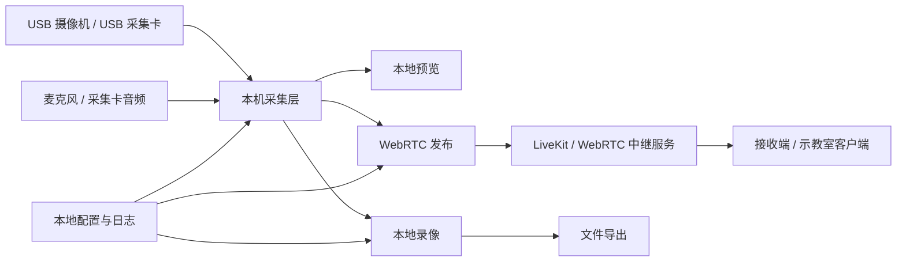

# 视捷UST USB-First 重构开发文档

## 1. 结论

视捷UST 后续不再以 ONVIF 网络摄像机、RTSP 流或独立编码器作为主要视频源路径。新的主架构采用 Windows + USB UVC 采集设备：

- 普通 Windows 笔记本或小主机作为运行载体。
- 一台 USB 摄像机或 HDMI/SDI 转 USB 采集卡作为主手术画面。
- 一到两路 USB 采集卡作为医疗影像、术野特写、超声、内镜、监护仪等辅助画面。
- 软件主流程围绕“一键开启直播、一键应答互动、一键录像、一键导出”设计。

RTSP/ONVIF 不删除认知价值，但必须从主流程降级为后续高级兼容能力。公开项目和 `.cn` 下载站的产品叙述也应同步调整为“USB 采集优先的免费轻量手术示教直播系统”。

## 2. 产品定位

### 2.1 目标用户

- 民营医院、医美医院、动物医疗机构。
- 缺少专业音视频工程师、网络工程师或信息科支持的小型机构。
- 需要快速完成手术观摩、教学示教、远程沟通、术中会诊预览的用户。

### 2.2 核心价值

降低视频接入门槛。用户不需要理解 IP、ONVIF、RTSP、摄像机鉴权、编码器推流配置，只要插入 USB 采集设备，在软件里选中画面并点击开始。

### 2.3 产品边界

视捷UST 是免费、轻量、易用的手术示教直播客户端，不是完整数字化手术室平台，也不是医疗器械。它不承担诊断、治疗决策、生命支持、患者监护或院内长期归档系统职责。

远程观看和双向互动不能仅靠客户端完成。互联网场景下必须有信令和媒体中继服务，例如 LiveKit 或同类 WebRTC SFU。客户端可以做到一键操作，但系统架构必须保留服务端。

## 3. 硬件与系统约束

### 3.1 推荐运行环境

- 操作系统：Windows 10 / Windows 11。
- 主机：常见笔记本、迷你主机或手术室移动工作站。
- USB：建议至少 3 个 USB 3.0 接口，或使用可靠的独立供电 USB Hub。
- 主摄像机：UVC USB 摄像机，或相机/术野设备经 HDMI/SDI 采集卡转 USB。
- 辅助信号：PACS 工作站、内镜、超声、监护仪、显微镜等经 HDMI/SDI 采集卡转 USB。

### 3.2 采集设备原则

- 优先选择免驱 UVC 设备。
- 优先 1080p30 或 1080p60，4K 只作为高级配置。
- 多路采集时优先保证稳定，不默认追求最高分辨率。
- 对同型号多个采集卡必须允许用户手动重命名，例如“术野主画面”“内镜画面”“监护仪画面”。

### 3.3 不再作为主线的设备

- 需要手动设置 IP 的网络摄像机。
- 需要开启 ONVIF 或 RTSP 鉴权的网络设备。
- 需要复杂推流配置的独立编码器。

这些设备后续可作为“高级网络视频源”保留，但不能影响主流程和产品文案。

## 4. 目标用户体验

### 4.1 首页即工作台

软件打开后不应先让用户面对技术配置项。第一屏应直接展示：

- 当前可用视频源。
- 主画面预览。
- 直播状态。
- 录像状态。
- 远端连接状态。
- 四个主要动作：开始直播、互动、录像、导出。

### 4.2 一键动作定义

- 一键开始直播：检测默认视频源、检测麦克风、连接房间、发布音视频轨道。
- 一键应答互动：接收远端房间邀请，打开远端画面与语音。
- 一键录像：录制当前主画面、可选辅助画面、麦克风音频和基础元数据。
- 一键导出：选择已录制文件，导出为用户能理解的文件名和目录结构。

### 4.3 必须避免的交互

- 不要求用户输入 RTSP 地址。
- 不要求用户手动填写摄像机 IP。
- 不要求用户理解 ONVIF Profile、端口、鉴权方式。
- 不把 FFmpeg、LiveKit、WebRTC 等技术词作为主界面显性配置项。

## 5. 目标架构



### 5.1 客户端仍保留 Tauri + React

保留当前 Tauri 2 + React + TypeScript + Vite 方向。原因：

- Windows 桌面发布成本低。
- 可以访问本地文件、日志、导出目录和系统诊断能力。
- 前端可直接使用 WebRTC/MediaDevices 体系做 USB 摄像头预览和发布。

### 5.2 采集层优先使用 MediaDevices

主路径采用浏览器/WebView 的 `navigator.mediaDevices.enumerateDevices()` 和 `getUserMedia()`：

- 免驱 UVC USB 摄像机天然暴露为 `videoinput`。
- 采集卡也通常暴露为 `videoinput`，部分带音频的采集卡暴露为 `audioinput`。
- 获取到的 `MediaStream` 可以直接用于本地预览和 WebRTC 发布。

必须做技术验证：Tauri WebView2 对多路 `getUserMedia`、设备选择、权限提示、分辨率约束和 MediaRecorder 的支持情况。验证失败时，备用路径是 Rust/FFmpeg DirectShow 采集，但这会提高复杂度，不应作为第一实现。

### 5.3 直播互动采用 WebRTC SFU

推荐以 LiveKit 作为第一版参考实现：

- 发起端发布主画面、辅助画面、麦克风音频。
- 接收端订阅画面和音频。
- 接收端可发布麦克风音频，形成双向语音互动。
- 房间创建和 token 签发必须由服务端完成。

公开 GitHub 项目可以提供：

- 客户端源码。
- 一个最小 token server 示例。
- LiveKit self-host 部署示例。
- `.cn` 下载站发布 Windows 客户端和说明。

不能在客户端硬编码 LiveKit 密钥或长期 token。

### 5.4 录像与导出

MVP 可先使用 MediaRecorder 录制本地 `MediaStream`。但必须在文档和界面中说明导出格式：

- 第一阶段：WebM 或浏览器支持的容器格式。
- 第二阶段：通过 FFmpeg 转码为 MP4，便于普通用户播放和归档。

如果要求“导出即 MP4”，则需要增加本地 FFmpeg 转码模块。FFmpeg 可以作为导出工具存在，但不再作为 RTSP 预览主链路。

## 6. 旧功能调整

| 现有能力 | 新架构处理 |
| --- | --- |
| ONVIF 自动发现 | 从主流程移除，后续作为高级网络源 |
| ONVIF GetStreamUri | 从主流程移除，后续作为高级网络源 |
| RTSP 本地 HLS 预览 | 从主流程移除，仅高级兼容保留 |
| 摄像机 IP/端口/用户名/密码表单 | 不再出现在默认新增视频源流程 |
| 发起端/接收端界面 | 保留角色概念，但改为一键直播和一键接收 |
| 本地配置和日志 | 保留，扩展为设备偏好、录像目录、房间配置 |
| LiveKit/WebRTC TODO | 升级为核心远程互动模块 |

## 7. 模块设计

### 7.1 前端模块

```text
src/
  domain/
    types.ts
  services/
    usbDeviceService.ts
    captureService.ts
    liveRoomService.ts
    recordingService.ts
    exportService.ts
    configService.ts
    logger.ts
  components/
    WorkbenchPage.tsx
    SourcePicker.tsx
    VideoSourceCard.tsx
    LiveControlBar.tsx
    UsbVideoConfigPanel.tsx
    NativeWorkerPanel.tsx
    RecordingPanel.tsx
    ExportPanel.tsx
    SettingsPage.tsx
```

### 7.2 Tauri/Rust 模块

Rust 侧不应承担视频主采集，除非 WebView2 验证失败。第一阶段只提供：

- 获取默认配置目录。
- 保存和读取配置。
- 写入日志。
- 选择录像目录。
- 写入录制文件或导出文件。
- 调用 FFmpeg 做可选转码。
- 提供设备和系统诊断信息。

### 7.3 数据模型草案

```ts
export type VideoSourceRole = "primary" | "auxiliary" | "medicalImage";

export interface UsbVideoSource {
  id: string;
  deviceId: string;
  label: string;
  displayName: string;
  role: VideoSourceRole;
  enabled: boolean;
  preferredWidth?: number;
  preferredHeight?: number;
  preferredFrameRate?: number;
  lastSeenAt?: string;
}

export interface AudioSource {
  id: string;
  deviceId: string;
  label: string;
  displayName: string;
  enabled: boolean;
}

export interface LiveRoomConfig {
  serverUrl: string;
  roomCode: string;
  displayName: string;
  role: "initiator" | "receiver";
}

export interface RecordingAsset {
  id: string;
  startedAt: string;
  endedAt?: string;
  sourceIds: string[];
  filePath: string;
  format: "webm" | "mp4";
  exported: boolean;
}
```

## 8. 核心流程

### 8.1 首次启动

1. 请求摄像头和麦克风权限。
2. 枚举 USB 视频设备和音频设备。
3. 自动选择第一个视频设备为主画面。
4. 如果有第二个视频设备，标记为辅助画面。
5. 引导用户给设备重命名。
6. 提示配置直播服务地址，允许先跳过。

### 8.2 一键开始直播

1. 检查主画面是否存在。
2. 检查直播服务地址和房间 token。
3. 打开主画面视频流和麦克风。
4. 发布到 WebRTC 房间。
5. 显示房间码或邀请状态。
6. 若失败，只显示用户能理解的错误，例如“没有检测到视频采集设备”“直播服务未连接”“网络不稳定”。

### 8.3 一键接收互动

1. 输入或扫描房间码。
2. 连接 WebRTC 房间。
3. 订阅发起端画面。
4. 默认开启扬声器播放。
5. 用户点击“开始讲话”后发布接收端麦克风。

### 8.4 一键录像

1. 使用当前主画面和麦克风启动录制。
2. 辅助画面可作为高级选项录制。
3. 自动生成文件名：`UST-Lite_机构名_YYYY-MM-DD_HH-mm-ss.webm`。
4. 记录基本元数据：机构、设备、开始时间、结束时间、来源设备。

### 8.5 一键导出

1. 列出最近录像。
2. 用户选择导出目录。
3. 可选导出 MP4、原始 WebM、日志、元数据 JSON。
4. 导出完成后直接打开所在目录。

## 9. 版本路线

### 0.2 USB 采集重构

- 移除默认 RTSP/ONVIF 表单。
- 实现 USB 设备枚举。
- 实现主/辅画面预览。
- 实现设备重命名和偏好保存。
- 增加无设备、设备被占用、权限失败提示。

### 0.3 一键录像与导出

- 实现主画面录制。
- 实现录像列表。
- 实现导出目录选择。
- 实现基础元数据导出。
- 验证 WebM 播放兼容性。
- 评估 FFmpeg 转 MP4。

### 0.4 WebRTC 直播互动

- 接入 LiveKit 客户端。
- 增加 token server 示例。
- 实现发起端一键开播。
- 实现接收端一键加入。
- 实现双向语音。
- 实现断线重连和状态提示。

### 0.5 公开发布版

- 更新 README 和 `.cn` 下载站文案。
- 发布 Windows EXE。
- 提供最小部署文档。
- 提供硬件推荐清单。
- 提供常见问题和故障排查。

## 10. 测试要求

### 10.1 硬件测试

- 无摄像头启动。
- 单个 USB 摄像头。
- 单个 HDMI USB 采集卡。
- 两个同型号采集卡。
- 三路 USB 视频源。
- 1080p30、1080p60。
- 4K 输入降级到 1080p。
- 采集卡热插拔。
- 设备被其他软件占用。

### 10.2 直播测试

- 发起端单路发布。
- 发起端双路发布。
- 接收端订阅。
- 接收端麦克风回传。
- 弱网断线重连。
- 房间码错误。
- token 过期。

### 10.3 录像测试

- 录制 1 分钟。
- 录制 30 分钟。
- 磁盘空间不足。
- 录制中断电或程序退出。
- 导出后普通播放器打开。

### 10.4 用户测试

找没有音视频基础的人员完成：

1. 插入 USB 采集卡。
2. 打开软件。
3. 看到预览。
4. 开始直播。
5. 接收端加入。
6. 开始录像。
7. 导出录像。

如果需要解释 IP、RTSP、ONVIF、端口、编码器推流，说明体验失败。

## 11. 发布与开源要求

### 11.1 GitHub

- README 必须改成 USB-first 叙述。
- 不得宣传完整远程医疗平台能力。
- 明确本项目不作为医疗器械。
- 提供最小 token server 示例时，不提交密钥。
- 不提交真实录像、真实患者信息、真实医院内部地址。

### 11.2 `.cn` 下载站

下载站主文案应从“ONVIF/RTSP 摄像机转播”调整为：

- 免费手术示教直播软件。
- USB 采集卡即插即用。
- 面向医美、民营医院、动物医疗机构。
- 支持一键预览、一键直播、一键录像、一键导出。
- RTSP/ONVIF 仅作为后续高级兼容能力。

## 12. 关键风险

### 12.1 WebView2 采集能力不确定

必须先做原型验证。重点验证：

- Tauri WebView2 是否能稳定枚举多个 USB 视频设备。
- 是否能同时打开两到三路视频。
- 是否能稳定 MediaRecorder 录制。
- Windows 权限和杀毒软件是否影响摄像头访问。

如果失败，改用 Rust/FFmpeg DirectShow 采集，但这会增加实现复杂度。

### 12.2 远程直播不能无服务端

如果用户跨公网观看，必须有信令和媒体服务。否则只能做局域网或点对点试验，不能承诺稳定一键远程直播。

### 12.3 录像格式兼容性

MediaRecorder 输出格式可能不是 MP4。普通用户更熟悉 MP4，因此 MP4 导出应作为 0.3 或 0.4 的重点。

### 12.4 USB 带宽和供电

多路 USB 采集不是无限可扩展。低端笔记本、低质量 Hub 或多路 4K 输入会导致掉帧、黑屏、音画不同步。软件必须提供降级策略。

## 13. 立即执行建议

1. 先写一个 USB 设备枚举和本地预览原型。
2. 验证 Tauri WebView2 能否打开 2 路 USB 视频源。
3. 验证 MediaRecorder 能否录制主画面。
4. 再大改 UI 和数据模型。
5. 最后才接 LiveKit/WebRTC。

不要先改远程直播，也不要继续在 ONVIF/RTSP 上加功能。当前产品方向已经变了，继续强化网络摄像机链路会偏离目标用户。
